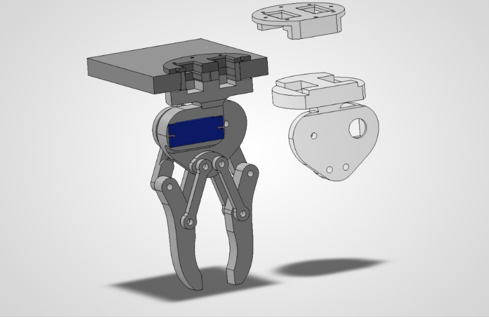
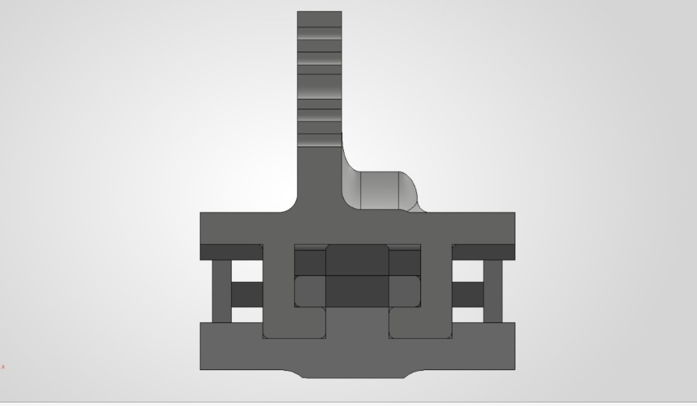
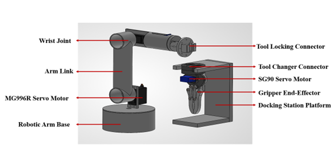

# Project_ARIES

This connector doesn't need any electricity to dock but can allow the end effector to use the electricity with a seperate section allocated to it.

This system includes 3 main components:

- host (in this case a robotic arm)
- end effector (in this case a mechanical gripper and a magnetic gripper)
- connector which connect both host and end effector.

The connector is placed in a holder and has 3 section:

- top - (which has a cut section so that the host can connect to it),
- button - (two spring activated mechanism used to lock, connect and hold the connector to the host properly)
- bottom - (usually an end effector is fixed to this part)

The robotic arm is controlled directly either by a teach pendant or from any device that suppport ROS2 jazzy (in this case my laptop) with the help of Arduino UNO R3.

> [!NOTE]
> View explaination file given in each folder to know more or click the following [3D_CAD_Models.Explanation](https://github.com/balaji-vm-official/Project_ARIES/blob/main/3D_CAD_Models/3D_CAD_Models.Explanation.md), [Circuit_Diagram.Explanation](https://github.com/balaji-vm-official/Project_ARIES/blob/main/Circuit_Diagram/Circuit_Diagram.Explanation.md), [ros-ws.Explanation](https://github.com/balaji-vm-official/Project_ARIES/blob/main/ros-ws/ros-ws.Explanation.md)

## 📄 Publication

Our research paper on this project has been peer-reviewed and published:

**Title:** Automatic Robotic Interchangeable End Effector System (ARIES)  
**Authors:** Balaji V. M., Ponnarasan S. A., Srinivasan K., K. K. Manivannan, K. Gobivel  
**Published in:** *EPJ Web of Conferences*, Vol. 363, 01005 (2026)  
**Official Paper Link:** [Read the full paper on EPJ Web of Conferences](https://www.epj-conferences.org/10.1051/epjconf/202636301005)

### Citation (BibTeX)
If you use this work or codebase in your research, please cite it:
@article{aries2026,
  author = {Balaji, V. M. and Ponnarasan, S. A. and Srinivasan, K. and Manivannan, K. K. and Gobivel, K.},
  title = {Automatic Robotic Interchangeable End Effector System (ARIES)},
  journal = {EPJ Web of Conferences},
  volume = {363},
  pages = {01005},
  year = {2026},
  doi = {10.1051/epjconf/202636301005}
}

### Images:

### Installation links:

- SW to URDF Exporter : https://wiki.ros.org/sw_urdf_exporter
- ROS2 Jazzy : https://docs.ros.org/en/jazzy/Installation/Ubuntu-Install-Debs.html
- MoveIt : https://moveit.ai/install-moveit2/binary/
- Arduino IDE : https://www.arduino.cc/en/software/
- KiCAD : https://www.kicad.org/download/

### Other links:

- GrabCAD : https://grabcad.com/library
- ROS Documentation : https://wiki.ros.org/
- MoveIt2 Documentation : https://moveit.picknik.ai/main/doc/examples/setup_assistant/setup_assistant_tutorial.html
